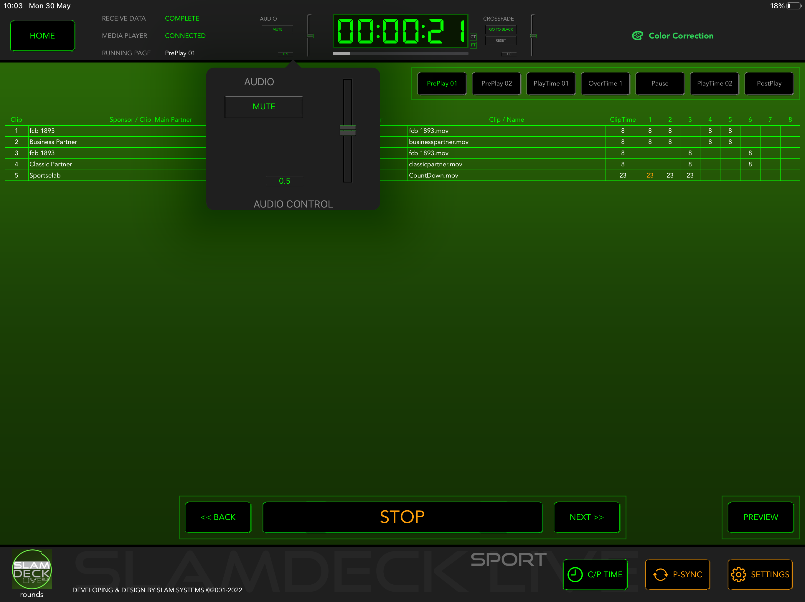

# Audio Control

Audio Control on the Top Bar shows the current settings of audio, for display only.

To setup audio, tap on it to popup the setting view.

Use the vertical slider to adjust the volumn.

Press **MUTE** button to mute audio, at the same time, the text color change to orange.
