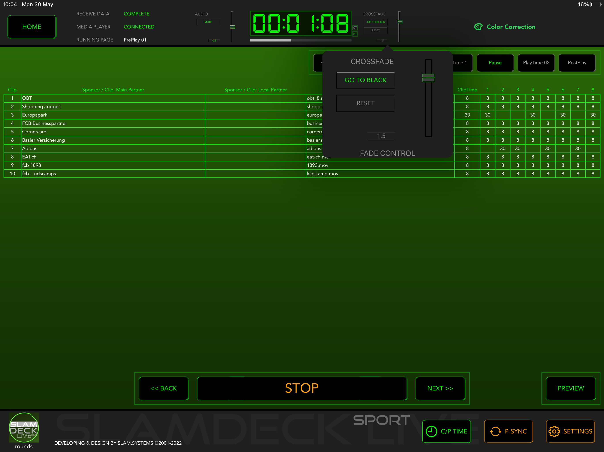

# Fade Control

Fade Control on the Top Bar only shows the current settings of cross fade, to setup fade, tap on it to popup the setting view.

Use the vertical slider to adjust the fade durations.

Press **GO TO BLACK** button to black screen, at the same time, pause the player.

Press **RESET** button to restore default settings.
