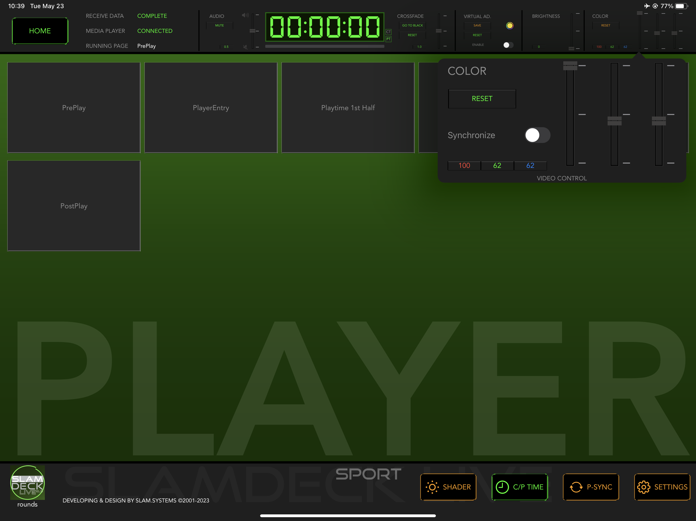
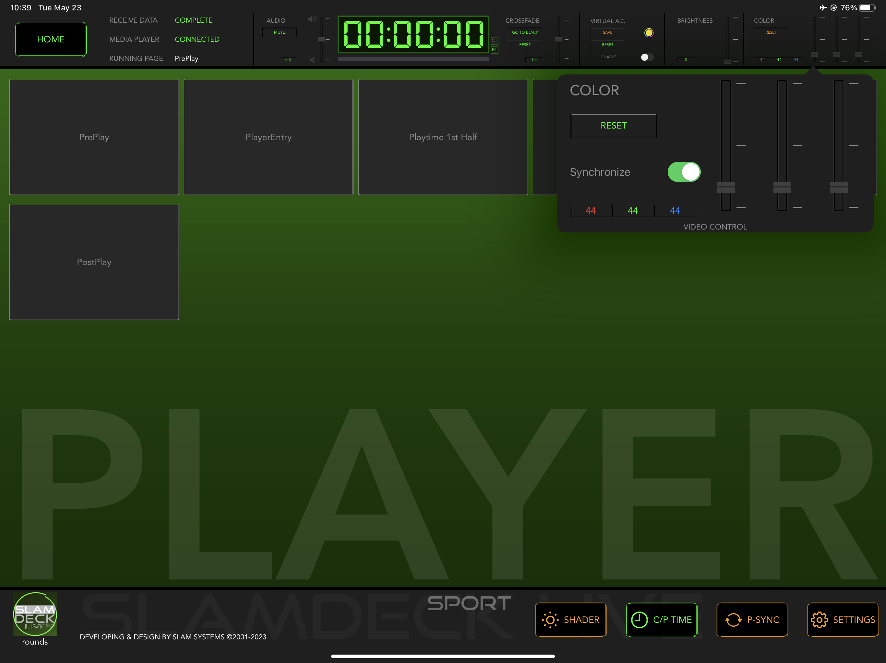

# Color

1. This feature may have to upgrade the player's version(Available since 2023.04).
1. This feature available for specific models (eg: Nemezes 10AC) and make sure USB cable connected between MAC and NOVAStart controller. When hardware support, control panel will show in top right of SPORT.app ,otherwise is blank. 
1. Drag then rise up finger will apply to whole screen.
1. If Synchronize is on, all the gain value is same as any slider you drag.
1. RESET value is not a fix number,it depend on specific LED models.  
1. For more detail please contact  Watermoon Inc.

