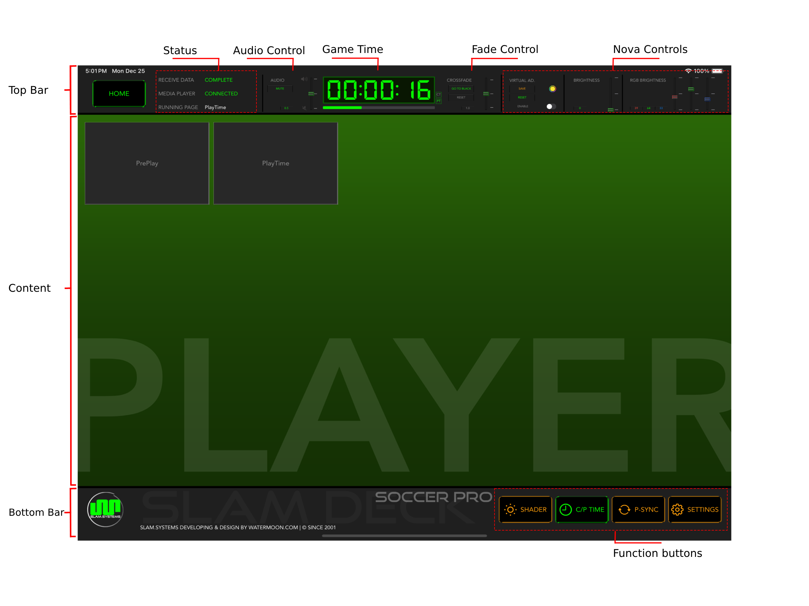

# Home

The interface of Sport app and its annotation.

* **Top Bar**
    - `Status`: show the status of RECEIVE DATA, MEDIA PLAYER and RUNNING PAGE.
    - `Audio Control`: Current settings of Audio Control, click to popup its setting view.
    - `Time Display`: Playing clip time or playlist time.
    - `Fade Control`: Current settings of Fade Control, click to popup its setting view.
    - `Nova Controls`: Including VIRTUAL AD. BRIGHTNESS and RGB BRIGHTNESS.
* **Content**
    - `Playlist`: Playlist of connected players.
    - `Overview`: Overview of one playlist. 
    - `Preview`: Preview of one playlist.
    - `Play Control`: Player control, Previous, Next, Play and Pause.
* **Bottom Bar**
    - `SHADER`: Adjusting shader range and brightness, load and save configurations.
    - `C/P Time`: Toogle button switch Time Display between clip Time and Playlist Time.
    - `P-SYNC`: Player Sync, setup players connection and sync.
    - `SETTINGS`: Setting Time Display counting and Sign Out. 
