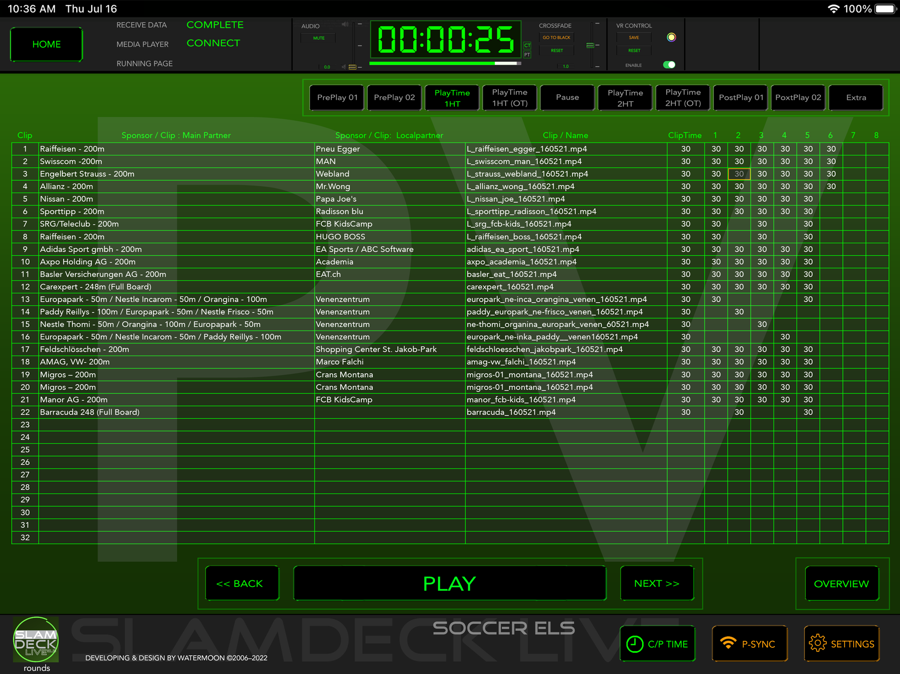
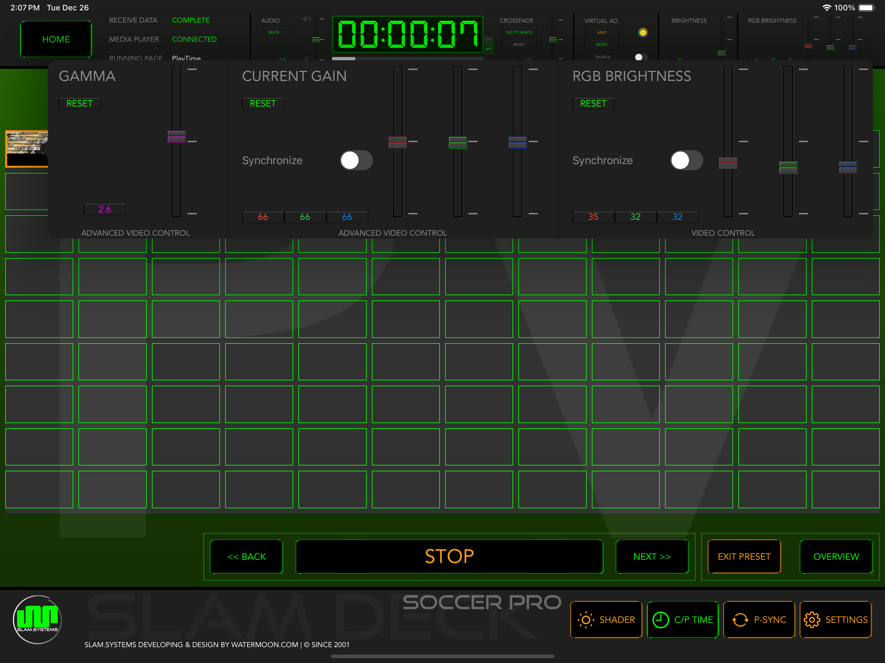
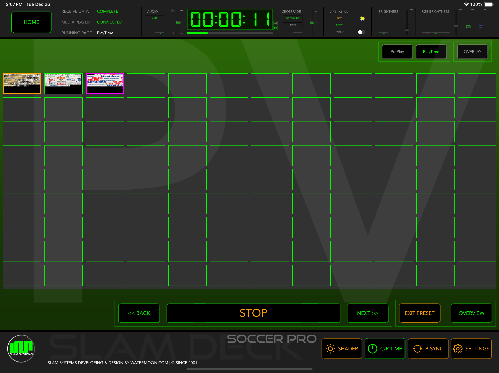

# Overview

If connected to the players, the clips of selected playlist will be listed here.

This layout and contents are same as the Number template.

Curring playing clip will show with highlight color.  

The **Playlist** row shown on the top-right content page, click the playlist button to switch playlist.

Click the **OVERVIEW** button will switch to [PREVIEW](preview.md) page.

If the player is not connected yet, please go to [P-SYNC](player-sync.md).

## Preset

Each clip could has its presets, including `GAMMA`, `CURRENT GAIN` and `RGB BRITHNESS`.

**NOTE**: Nova controller connect to the PLAYER machine by USB is *NEEDED*.

The `PRESET` button is on the bottom of [OVERVIEW](overview.md)  page, next to `OVERVIEW` button.

To enable preset mode, just click the `PRESET` button, then a alert will be shown and confirm you need to enable the preset mode, in case click by mistake.

**NOTE**: It is strongly recommended to enter PRESET mode only during debugging phase.

During preset mode, click on a clip to start configuring its preset.

Each adjustment is saved immediately after the change. 

The selected clip will loop for easy debugging.

If the clip has a preset, it will appear with magenta highlight border in the Overview list (only during the preset mode).  

Click the `EXIT PRESET` button to exit PRESET mode.