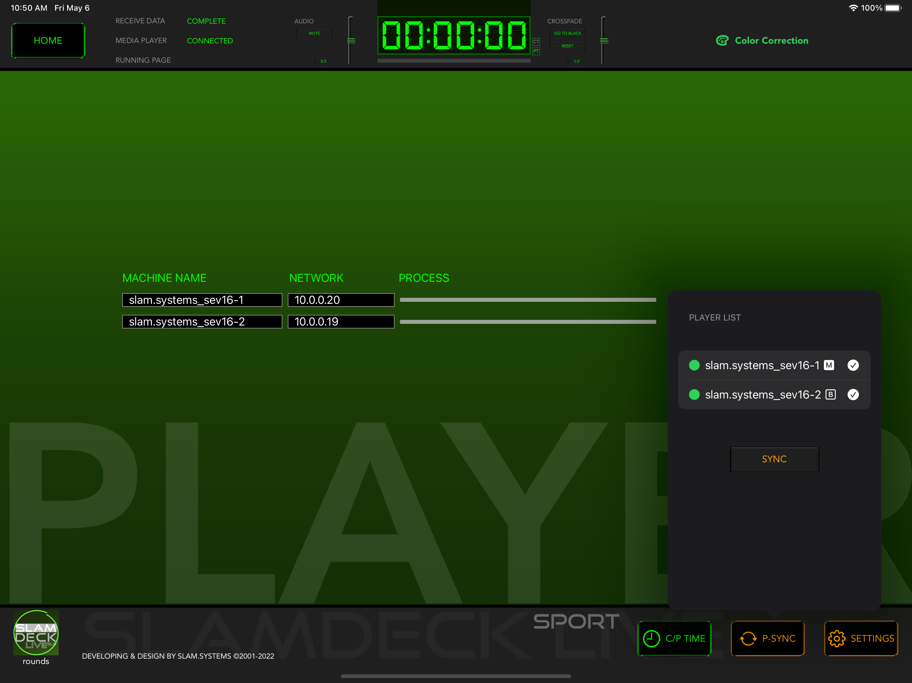

# P-SYNC

1. Tap **P-SYNC** button;
1. Check the circle box to select Players;
1. Click **SYNC** button to start connection and synchornise.

The PROCESS bar showing the sync progress, disappears after sync is complete. 
