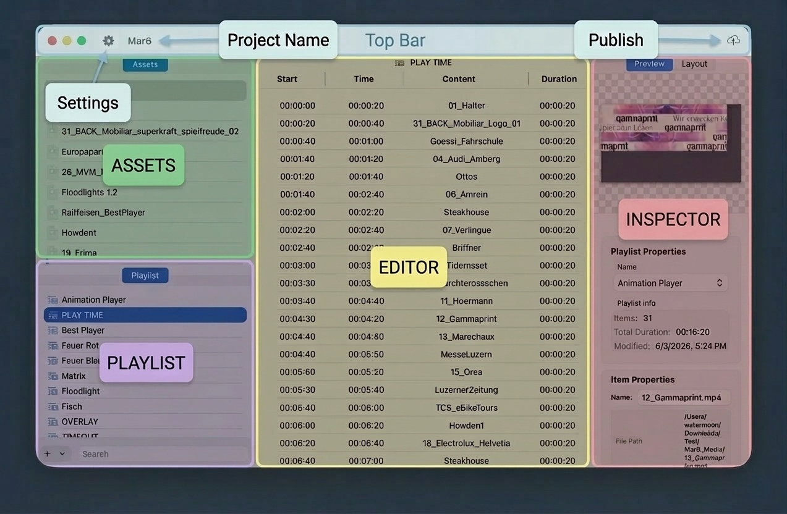

# DIRECTOR COR

**DIRECTOR COR** is a macOS app for managing media libraries, editing playlist timelines, and publishing schedules to [SLAM PLAY COR-HD](../player-cor/) on the network. It targets **macOS 16 and later** and, for typical workflows, works with **Numbers** to import playlist data from spreadsheet templates. This manual summarizes the main window and links to deeper topics for each part of the interface.

The application interface is divided into several logical zones, enabling an intuitive workflow from file organization to final delivery. This layout, optimized for macOS 16's modern aesthetics and performance, is divided into five key regions: the **Top Bar**, the **Assets** panel, the **Playlist** panel, the central **Editor**, and the **Inspector**.

## Overview

| Region | Description |
|--------|-------------|
| [Workflow](workflow.md) | From creating a project to publishing playlists to devices |
| [Top Bar](top-bar.md) | Command center: window controls, Settings, project name, Publish |
| [ASSETS](assets.md) | Media library: import, organize, and manage source files |
| [PLAYLIST](playlist.md) | Master list of play sequences; select a playlist to edit its timeline |
| [EDITOR](editor.md) | Timeline table: Start, Time, Content, Duration; drag-and-drop sequencing |
| [INSPECTOR](inspector.md) | Context-aware properties: preview, playlist info, layout behavior, item properties |

See the linked pages for detailed descriptions of each area.
