# Workflow Overview

This chapter describes a complete workflow from **creating a new project** to **publishing to devices**.  
The example uses a **Numbers spreadsheet template** and multiple playback devices; you can adapt it to your own setup.

## Installation and Requirements

Before starting the workflow, complete the installation and environment setup:

1. Sign in to the SLAM Cloud portal: <a href="https://cloud.slam.systems/" target="_blank" rel="noopener noreferrer">cloud.slam.systems</a>.  
2. Go to the **Resources** section and download the latest DIRECTOR COR package.  
3. Install DIRECTOR COR on your Mac.

Runtime system requirements:

- **macOS 16**  
- **Numbers.app installed** (required for template import and automation)

## Tutorial Video

<iframe width="560" height="315" src="https://www.youtube.com/embed/gLx4z0WvIpU?si=O-4Mld4k3bwDK7ZN" title="SLAM.SYSTEM COR Tutorial" frameborder="0" allow="accelerometer; autoplay; clipboard-write; encrypted-media; gyroscope; picture-in-picture; web-share" referrerpolicy="strict-origin-when-cross-origin" allowfullscreen></iframe>

If the embedded player is blocked in your environment, watch here:
<a href="https://www.youtube.com/watch?v=gLx4z0WvIpU" target="_blank" rel="noopener noreferrer">SLAM.SYSTEM COR Tutorial on YouTube</a>

High-level steps:

1. Create a new DIRECTOR COR project  
2. Import a playlist from a Numbers template  
3. Select the Numbers template file in the system file picker  
4. Open the Device Settings window  
5. Discover and add devices on the local network  
6. Review and manage the device list  
7. Publish and monitor sync progress  
8. Confirm publish completion

# Step 1: Create a New Project

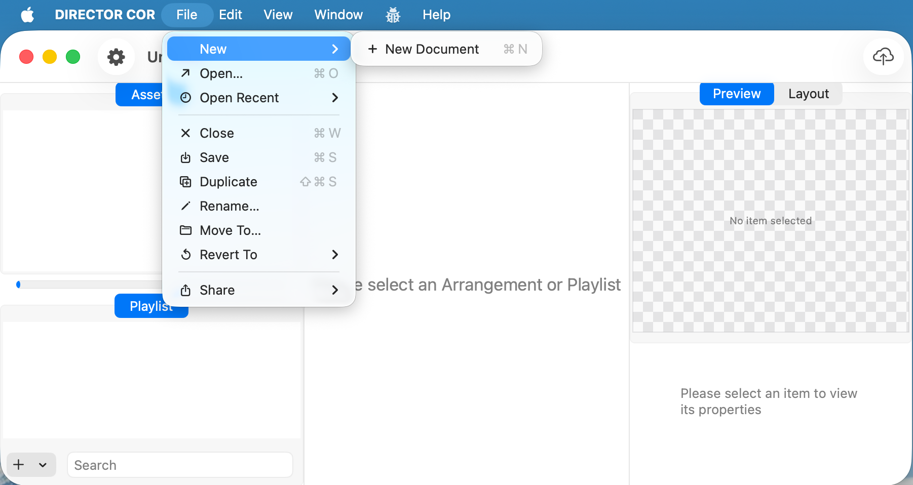

1. From the top menu choose `File` → `New`, or use the keyboard shortcut to create a new document.  
2. After creation, the window title shows `Untitled`, and both the `Assets` and `Playlist` areas are empty.  
3. The `Preview / Layout` switch is already visible in the top-right corner, but there is no content to preview yet.
4. Save this document, for example: `Untitled.cor`.

# Step 2: Import from a Numbers Template

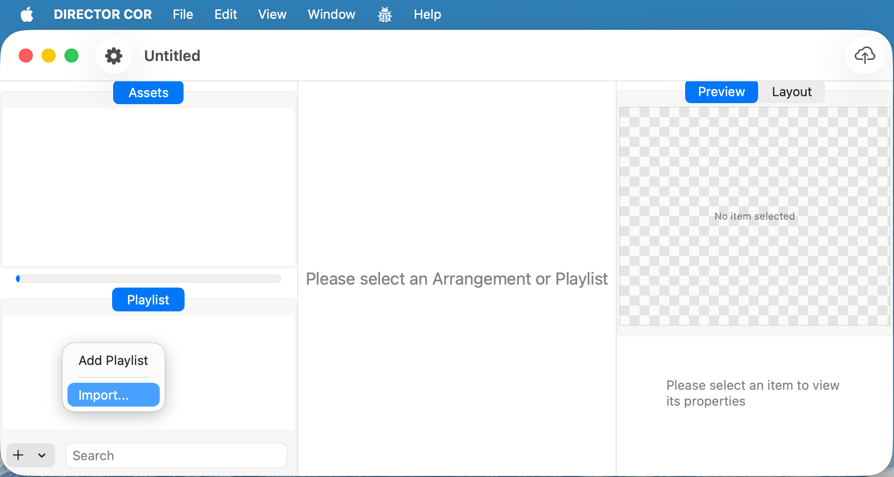

1. In the `Playlist` area at the bottom-left, click the `+` button.  
2. In the pop-up menu, choose **Import…**.  
3. The import feature can read an external template (such as a Numbers spreadsheet) and automatically generate playlist items and timeline entries.

### If prompted: grant system permissions

During the first import, macOS may prompt you to grant permissions so DIRECTOR COR can automate Numbers and control the UI:

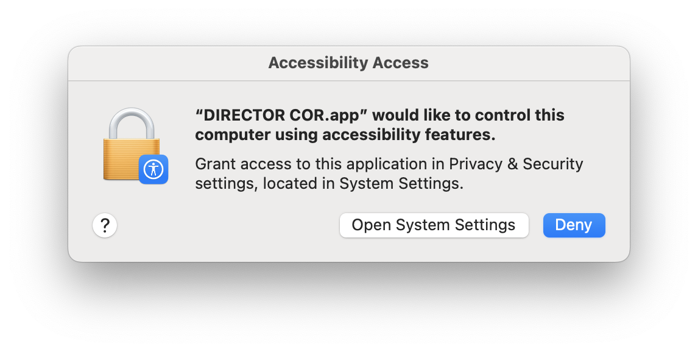

- Click **Open System Settings** to grant Accessibility access.

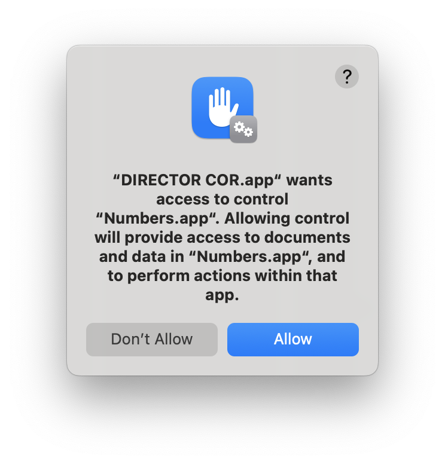

- Click **Allow** to permit DIRECTOR COR to control `Numbers.app`.

Then, in System Settings → Privacy & Security:

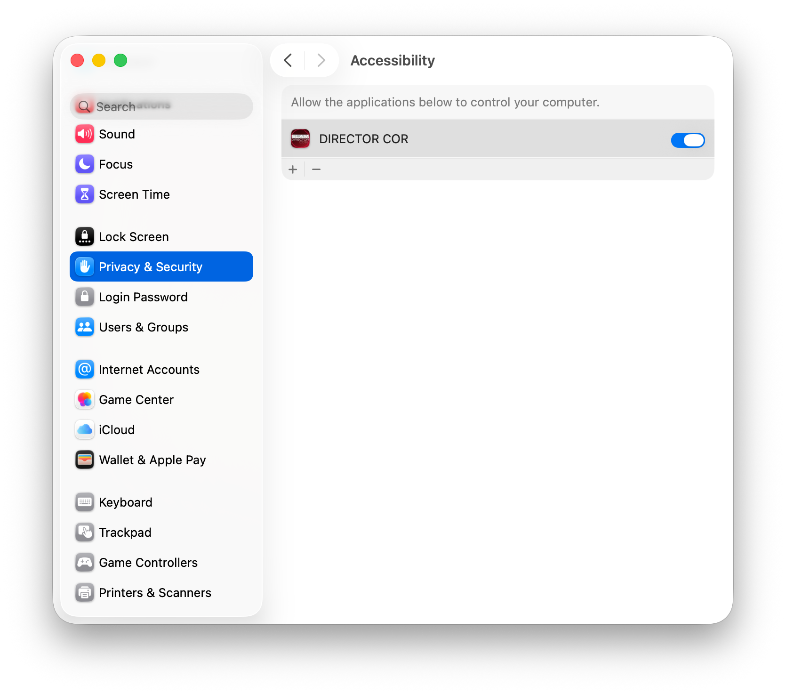

- Ensure **DIRECTOR COR** is enabled under Accessibility.

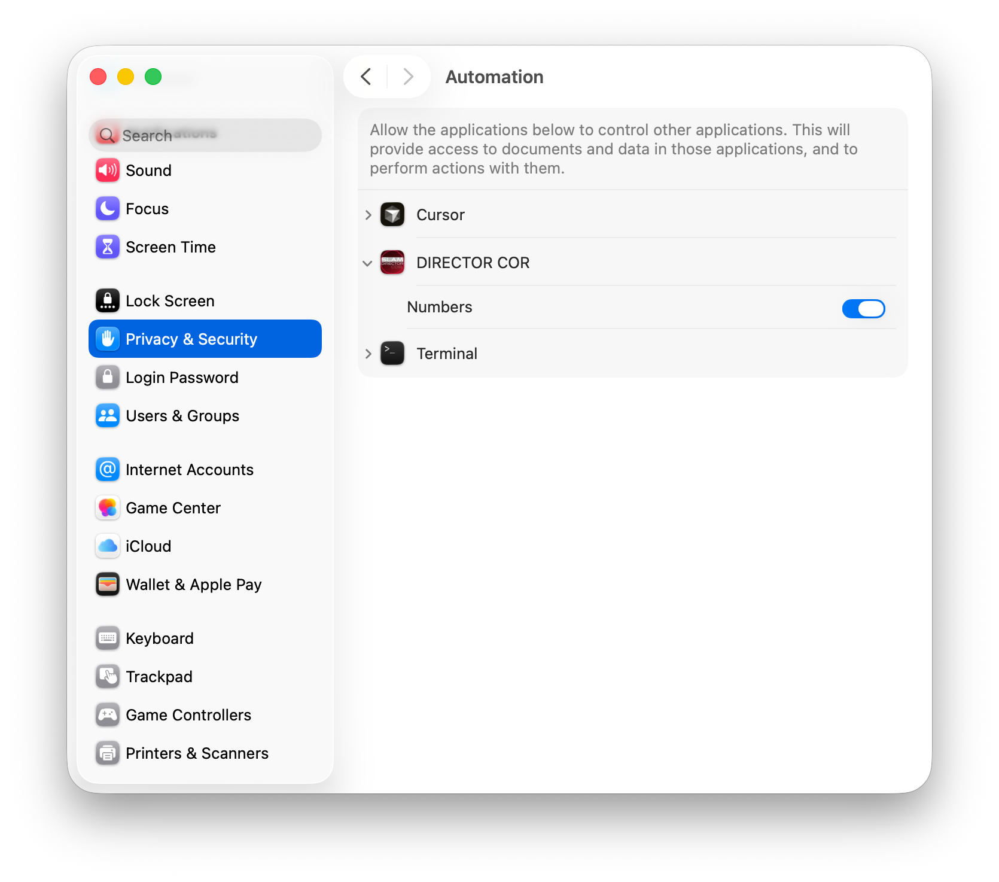

- Under Automation, expand **DIRECTOR COR** and enable control of **Numbers** (and other required apps, if listed).

# Step 3: Choose the Numbers Template File

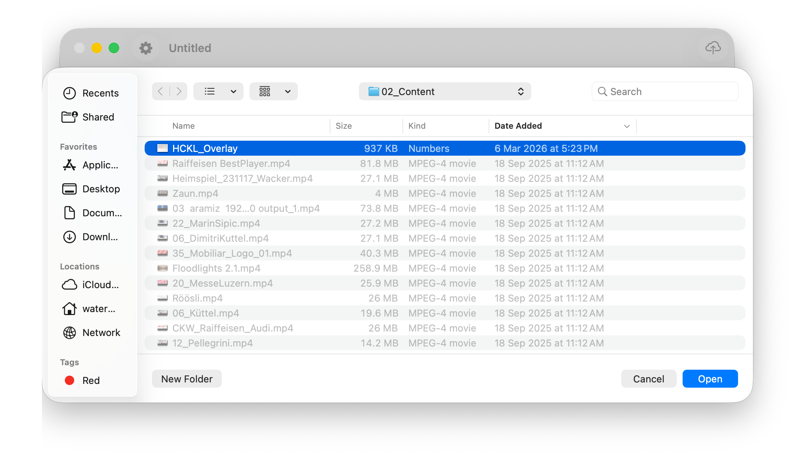

1. In the system file picker, navigate to the folder that contains your template.  
2. Select the prepared Numbers template (for example `HCKL_Overlay`), and make sure its structure matches the DIRECTOR COR import format.  
3. Click **Open**. DIRECTOR COR parses the template and generates the corresponding playlist and Editor rows.

# Step 4: Open Device Settings

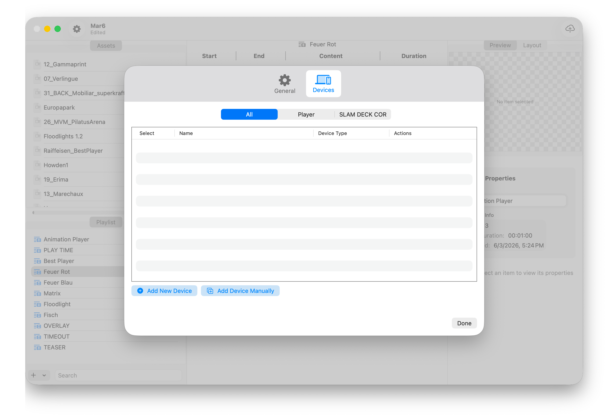

1. After the import has created your playlist, open the Device Settings window (typically via the Settings icon or menu).  
2. In the dialog that appears, switch to the **Devices** tab.  
3. At the top, choose the current Player type (for example `SLAM DECK COR`) so that only relevant devices are shown.

# Step 5: Discover and Add Devices

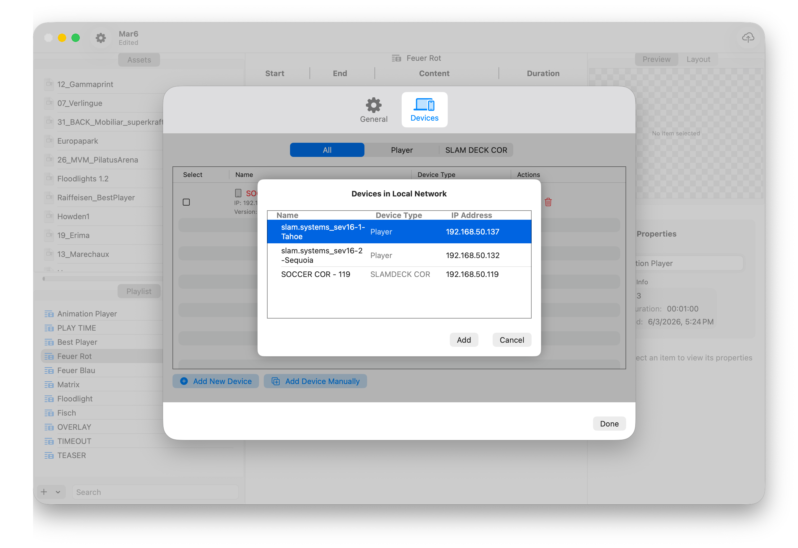

1. In the Devices window, click **Add New Device** to start scanning the local network.  
2. The **Devices in Local Network** sheet lists available players and control devices, including:  
   - Device name (for example `slam.systems_sev16-1-Tahoe`)  
   - Device type (`Player` or `SLAM DECK COR`)  
   - IP address  
3. Select the devices you want to use for this project, then click **Add** to add them to the device list.

# Step 6: Manage the Device List

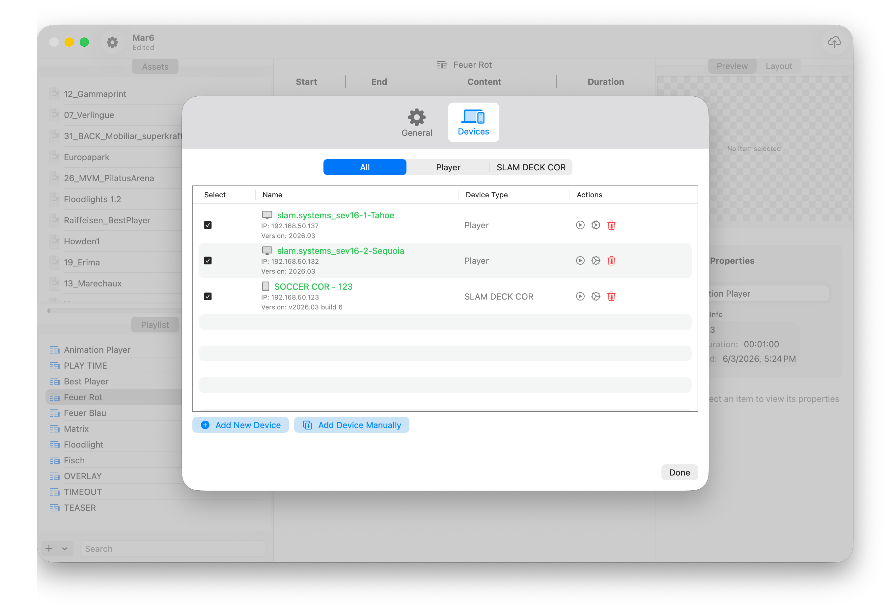

1. Back in the main Devices window you can now see all added devices:  
   - Each row shows the name, IP address, version, device type, and more.  
   - Use the checkboxes on the left to choose which devices should receive the current project.  
2. The action buttons on the right can be used to:  
   - Test connectivity  
   - Re-sync  
   - Remove the device from the list  
3. When everything looks correct, click **Done** to return to the main window.

# Step 7: Publish and Monitor Sync Progress

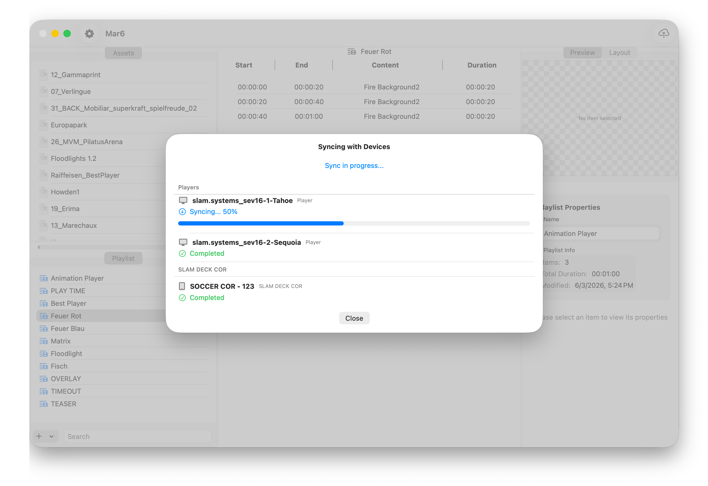

1. Click the **Publish** cloud icon in the top-right corner to start the publish process.  
2. The **Syncing with Devices** window shows sync progress for each device:  
   - “Syncing…” indicates that data is being transferred or processed  
   - A progress bar shows the current percentage  
3. While publishing, keep the network connection stable and avoid closing the app or target devices.

# Step 8: Publishing Complete

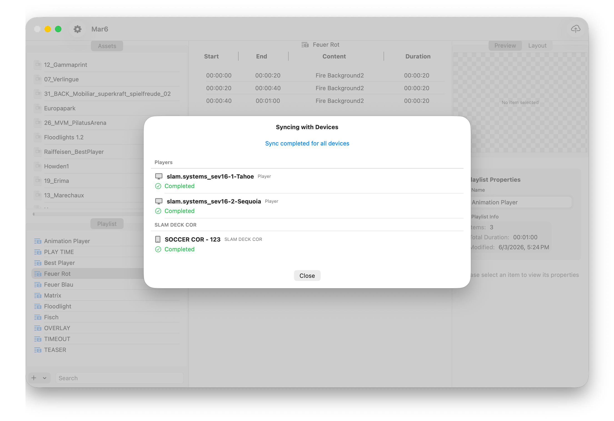

1. When the status for all devices changes to **Completed**, the top of the window shows **Sync completed for all devices**.  
2. At this point, the playlist has been successfully distributed to all selected Player and SLAM DECK COR devices.  
3. Click **Close** to dismiss the dialog, then verify playback on site or in your test environment.

With these steps, you complete the full DIRECTOR COR workflow: create a project, import a template, connect devices, and publish your playlists.

## Additional Video

RGB Controller Configuration: SLAM DECK COR & Nova Controller  
<a href="https://www.youtube.com/watch?v=FuMLAPr5O3Q" target="_blank" rel="noopener noreferrer">Watch on YouTube</a>
