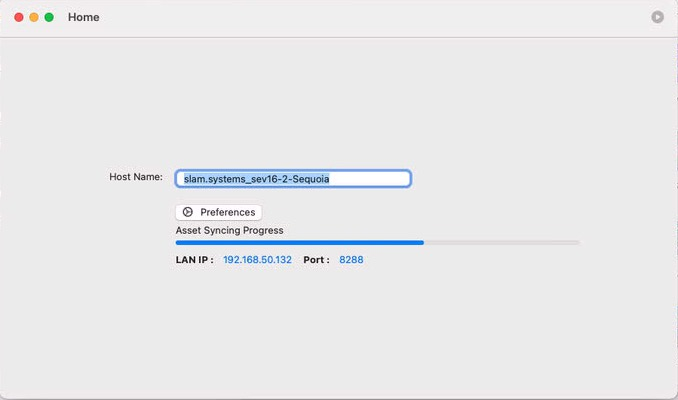
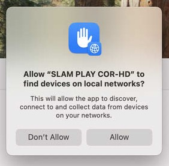
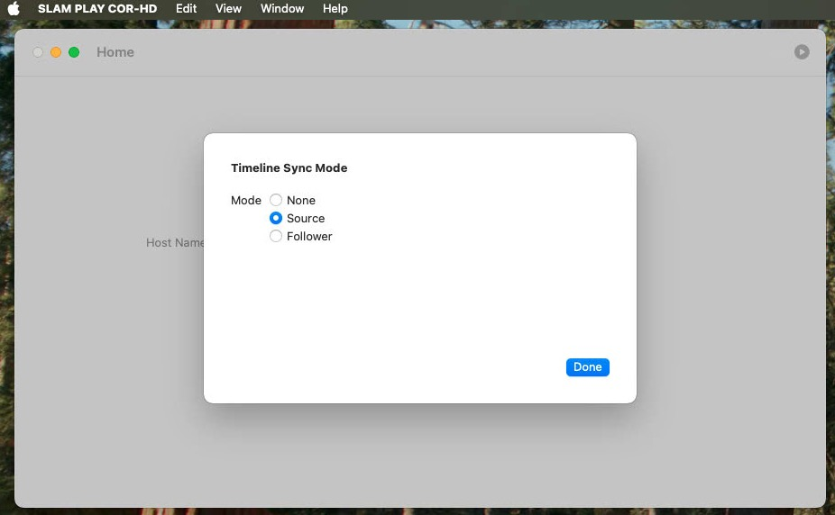
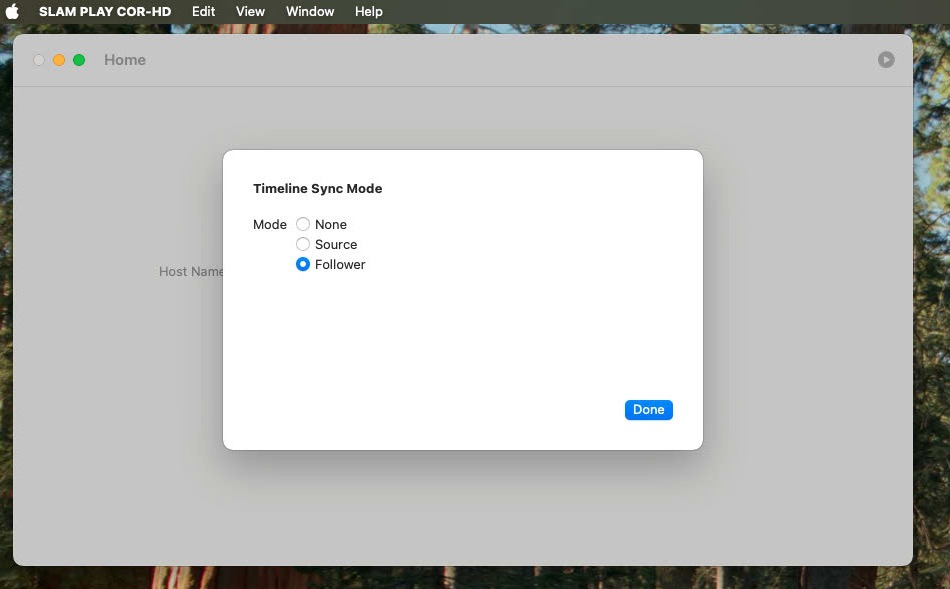

# Configuration

- **Host Name** Default is machine name, you can change it want you want.

- **Preferences**. To select TimeLine Sync Mode between players. Default is None, if set to Follower player will sync the playback timeline from Source player, for the best experience, 
	Timeline Sync will affect in conditions below:  
	             1: Use DIRECTOR COR to publish content to players. 
	             2: one player is Source Mode and others is Follower Mode. 
				 3: Playing same playlist and same clip between players. 
				 4: Local Network permission must be Allow when player prompt permission request.  
				 6: IGMP setting in Router and switch must be enabled. 
				 7: At present, do not set more than one Source Mode in LAN. 

 
 
 

**Allow local Network Permission when prompt**

 

**Receive asset,playlist from DIRECTOR COR**

 

**Set timeline sync mode to Source**

 

**Set timeline sync mode to Follower**

 

