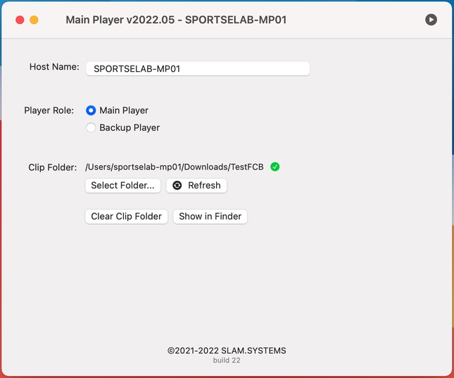

# Configuration

- **Host Name** Default is machine name, you can change it want you want.

- **Player Role**. select role of player, if select Main that means you to select clip folder,if select backup means clip must synchronize from Main Player.
- **Select Folder...**. choose your folder contain clips and playlist(csv file)
- **Refresh**. Validate destination content in folder. If content is invalid,
- **Show in Finder**. Popup finder of clip folder . 