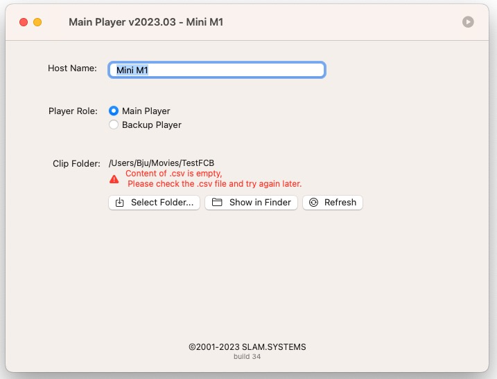

# Configuration

- **Host Name** Default is machine name, you can change it want you want.

- **Player Role**. select role of player, if select Main that means you to select clip folder,if select backup means clip must synchronize from Main Player.
- **Select Folder...**. choose your folder contain clips and playlist(csv file)
- **Refresh**. Validate destination content in folder, if valid, a green mark icon prompt, otherwise red color tips prompt.
      &nbsp;&nbsp;&nbsp;&nbsp;&nbsp;&nbsp;&nbsp;&nbsp;&nbsp;&nbsp;&nbsp;&nbsp;&nbsp;&nbsp;&nbsp; For more  detail of error using [Diagnosis](diagnosis.md) to correct your playlist content.
- **Show in Finder**. Popup finder of clip folder. 

 
 
 

**Lists of error occur**

 

 

 

 

 

 

