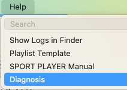
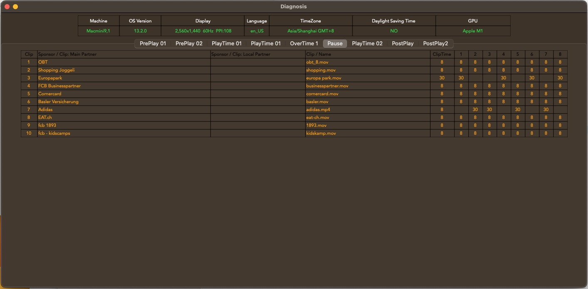
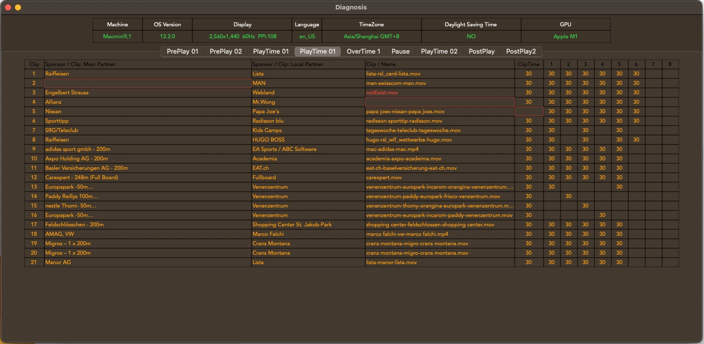
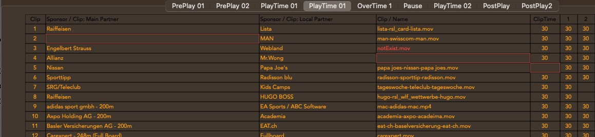
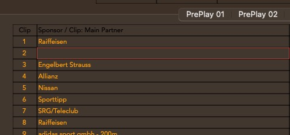
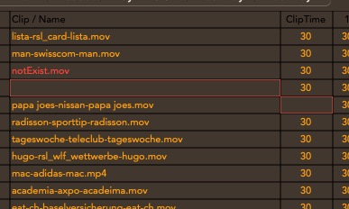

# Diagnosis

- Select Menu 'Help'->Diagnosis 

 
 
 
 
 

- Upper part is about system information e.g(OS, Display) 

 
 
 
 
 
 
 

- Lower part is preview playlist   When empty content in column of 'Main partner' and 'Clip /Name ' and 'ClipTime', the border's color is red.  When 'Clip /Name ' is filled but file is not found ,the text color is red.

