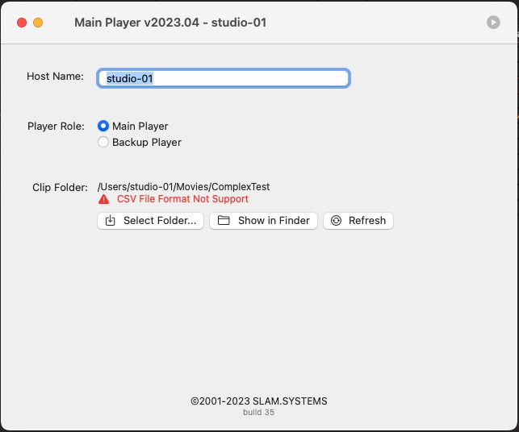
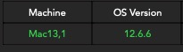
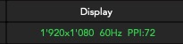
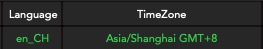
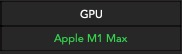

# Diagnosis

 
**When something invalid in playlist, use this function to find out what exactly wrong in playlist, because sometime
maybe more than one error in playlist, then correct the content in origin playlist(.numbers or .xlsx file) and export to csv format again to replace  invalid csv file.**
 
 
 

- Select Menu 'Help'->Diagnosis 
     

 

 

 

 

 
 
Upper part is about system and some hardware information, such information can be feedback to us after the problem occurs to isolate the problem.

 
 
 
 
 
 

 
Lower part is playlist preview, when playlist is valid, content is similar to orange color, otherwise there is red color text of red color border to isolate at exactly field.

  
  
  
Here is list reason of invalid content:

'Clip' filed is empty, red border will be around.

'Sponsor / Clip: Main Partner' is empty, red border will be around.

'Clip /Name' field is empty, red border will be around.

'Clip /Name' field is filled, but clip file is not exist in folder there will be a red text.

'Clip /Name' field is filled, but clip is not compatible with PLAYER( currently only support QuickTime Format .mov .mp4, m4v ) there will be a red text.

'ClipTime' field is empty, red border will be around.

* Notice: 'Sponsor / Clip: Local Partner' and 1-8 field can be empty.