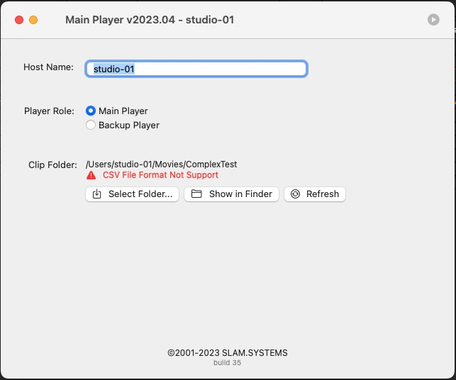
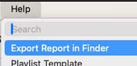
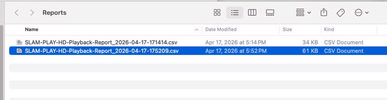
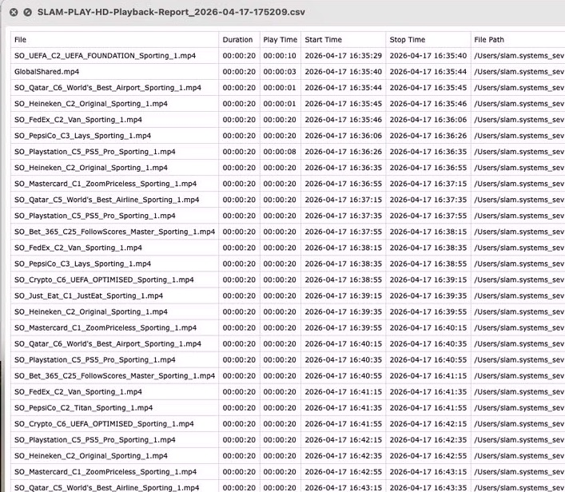
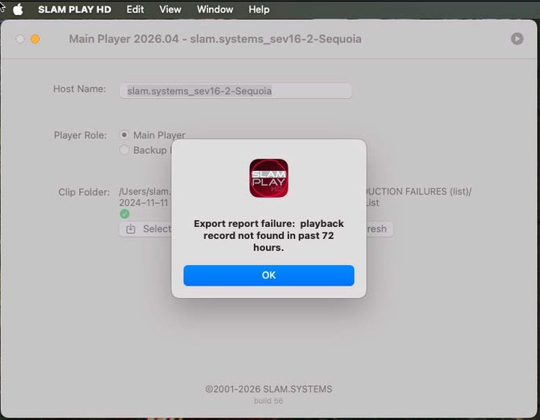
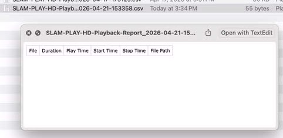

# Export Playback Report

 
**This function is specific for the one which want to the detail of playback,
    you should export the report  in 72 hours after playback stop .
**
 
 
 

- Select Menu 'Help'->Export Report in Finder. 
     

You can export the playback report in 72 hours after playback stop, otherwise you can not export report or empty record in report file.

playback report file is a CSV format, you can preview it in Finder or open it by Numbers.app if you want to export to PDF file.

 
 

 
 

 
 

 
 
 

  
  
 

* Notice: Export Report function available from 2026.04, you should use version 2026.04 to playback, then you can export a valid record playback report.
