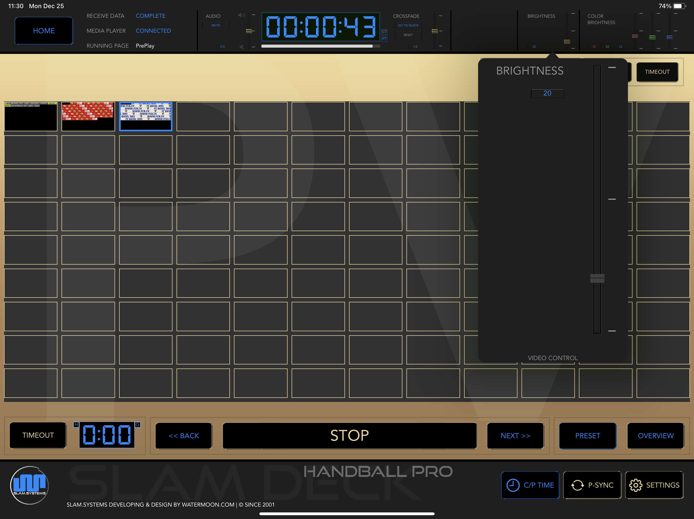

# Brightness

1. This is function can be work with models of Novastar Controller in VX16s, MCTRL 660 pro, MCTRL 4K.

1. Make sure USB cable connected between Controller and Mac.

1. For more detail please contact Watermoon .

