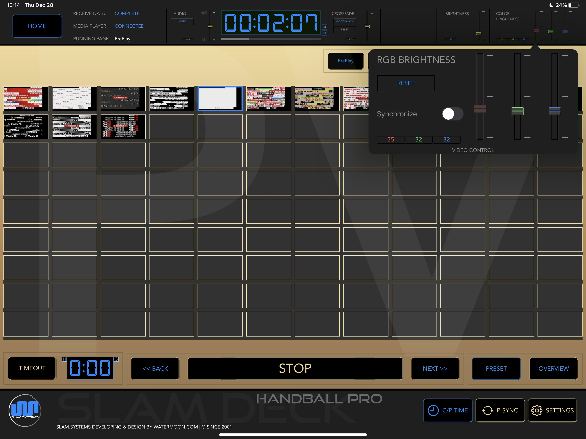

# RGB Brightness

1. This is function can be work with models of *Novastar Controller in MCTRL 660 pro, MCTRL 4K.

1. Make sure USB cable connected between *Novastar Controller and Mac, otherwise the RGB Brightness control panel will be empty.

1. Make sure LED screen is Power On and signal line(using Ethernet Line) is connect between *Novastar Controller and LED screen, otherwise the RGB Brightness control panel will be empty.

1. RESET value is Red:50 Green:50 Blue:50

1. For more detail please contact support team. 

### *  Novastar is a trademark belong Xi'an NovaStar Tech Co., Ltd.