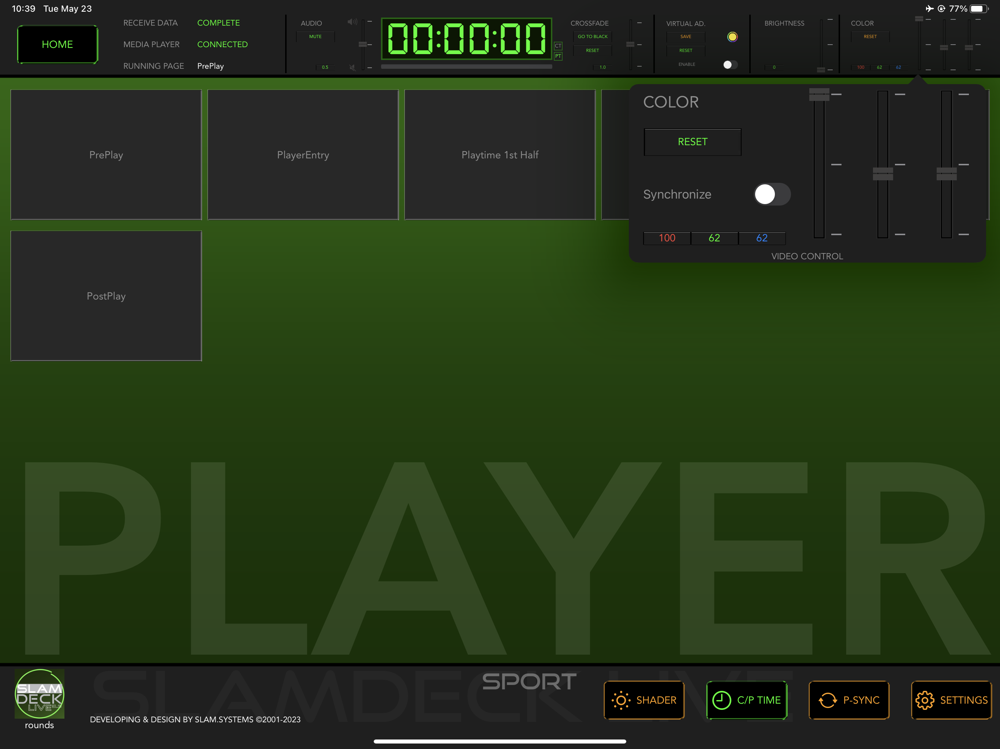
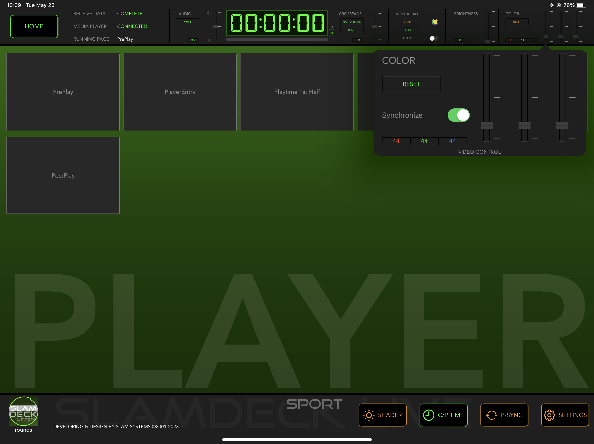

# Color

1. This function may have to upgrade the version of the player(available since 2023.04)
1. This function is available for specific LED models (eg: Nemezes 10AC) and make sure USB cable connected between MAC and NOVAStart controller. If hardware support, control panel show in top right,otherwise is blank. For more detail please contact  Watermoon Inc.
1. Drag slider and drop your finger then when it will affect to whole screen.
1. If Synchronize is on, all the gain value is same as any slider you drag.
1. RESET value is not a fix number,it depend on specific LED models. or more detail please contact Watermoon Inc.

