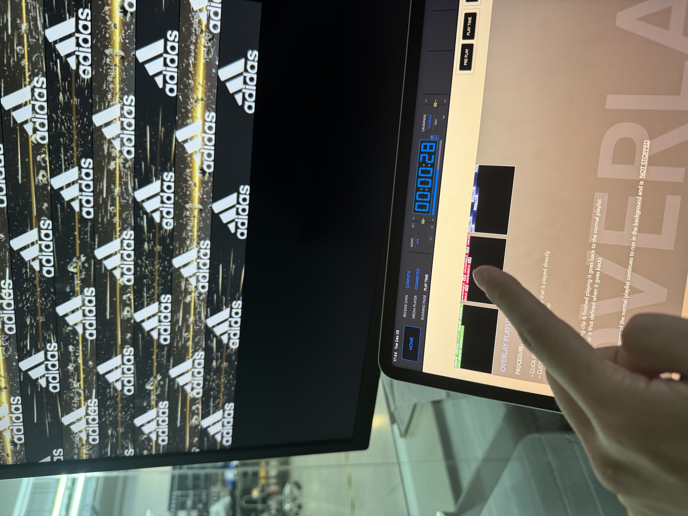
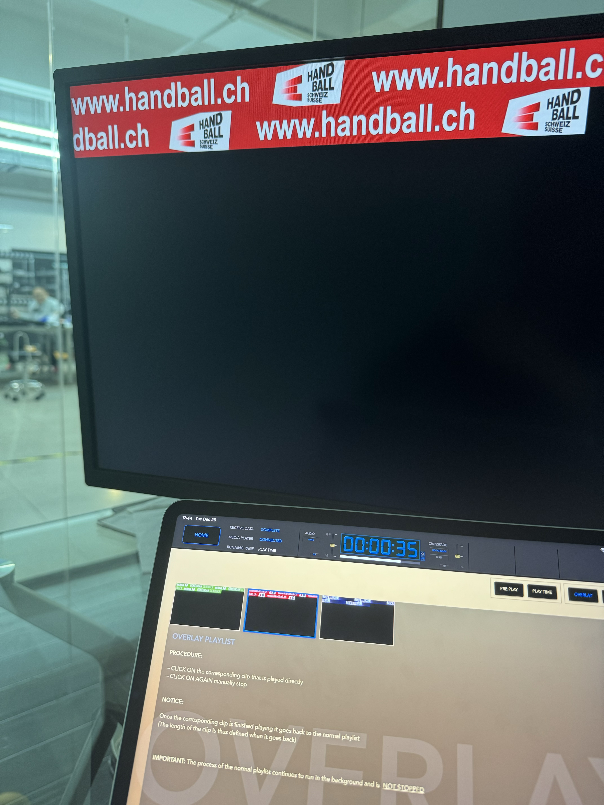
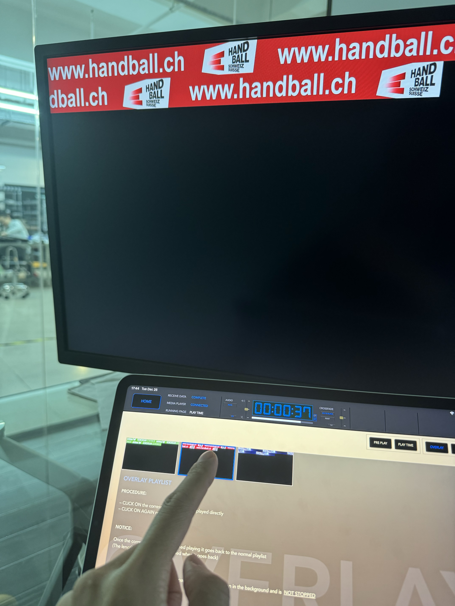
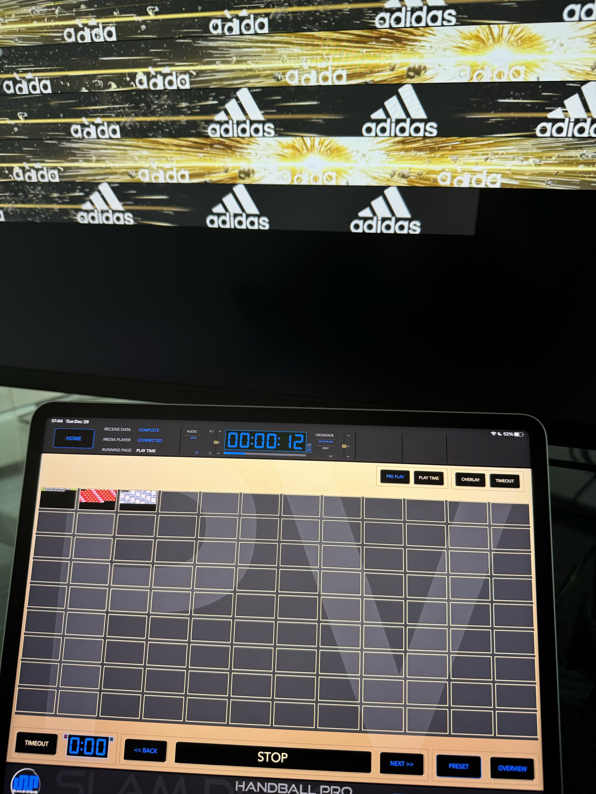

# OVERLAY

## Noticement

1. Playlist MUST contain overlay of OVERLAY list and it's content, otherwise,  OVERLAY function can not works properly.

## Preview

## Demostration
**PLAY OVERLAY**

Tap OVERLAY in playlist bar

Tap thumbnail button to play overlay clip

Overlay clip is cover in normal clip

**Cancel Overlay**

Tap the currently playing Overlay clip

Overlay is remove from normal clip

