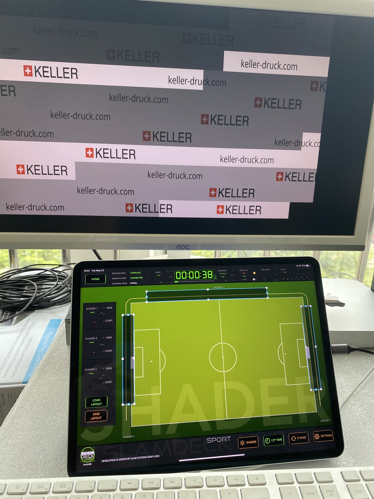
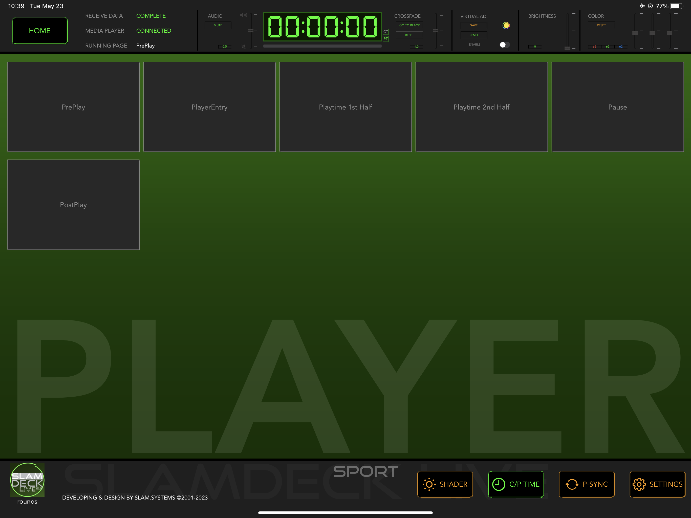
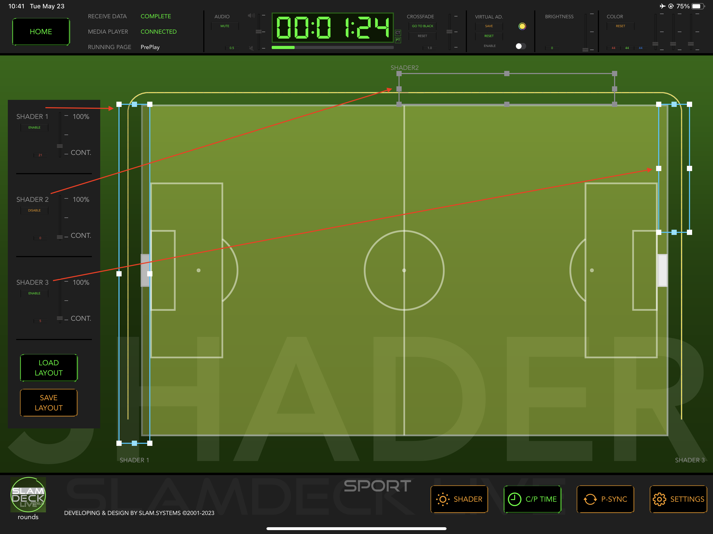
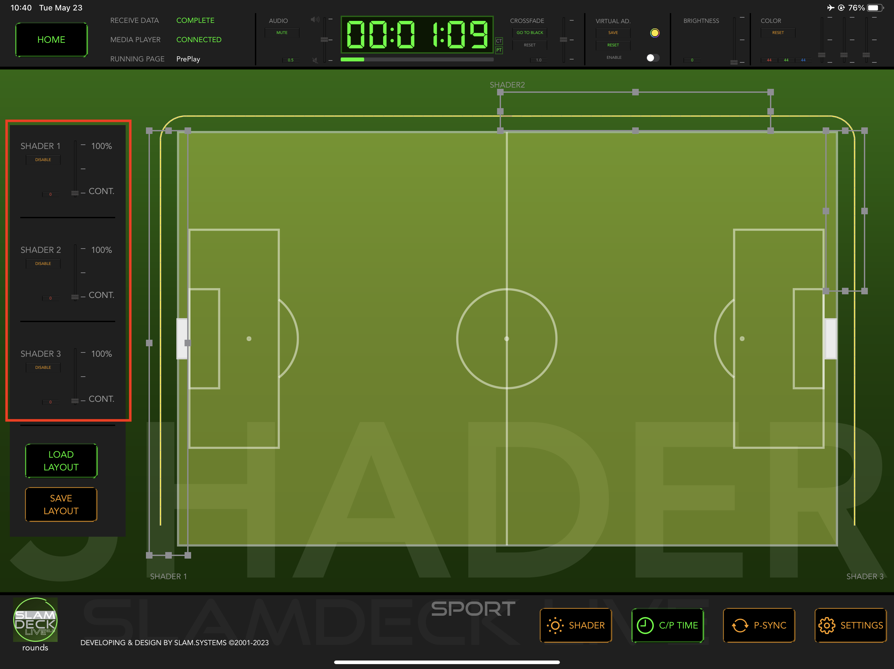
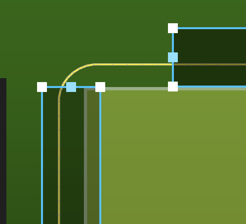
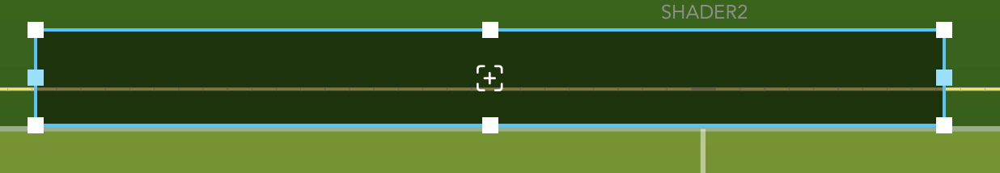

# SHADER

1. Tap **SHADER** button

 
 
 
 
 

1. Config Panel 

 
 
 

1. Enable/Disable SHADER layout or transparent condition 

 
 
 

1. Adjusting shader range or long press the shader bar is can be drag to change shader position.

