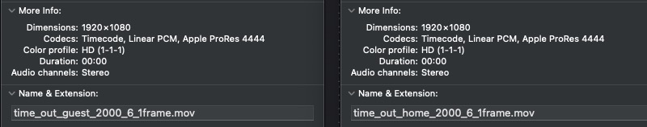
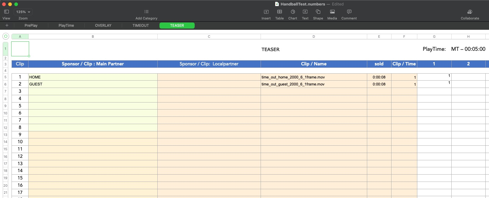
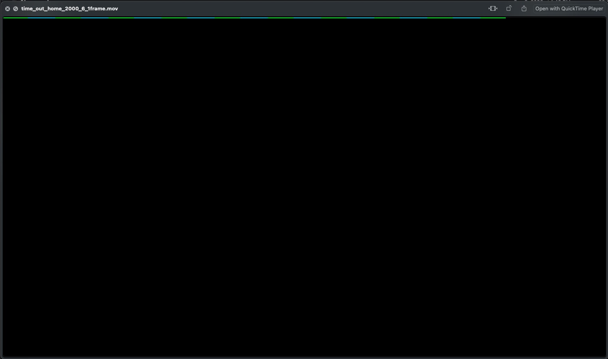
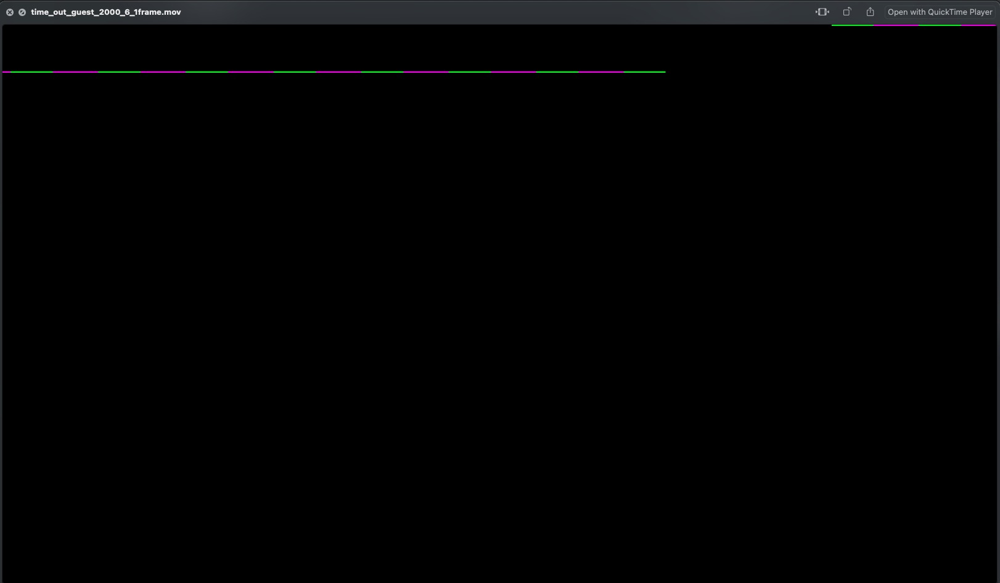
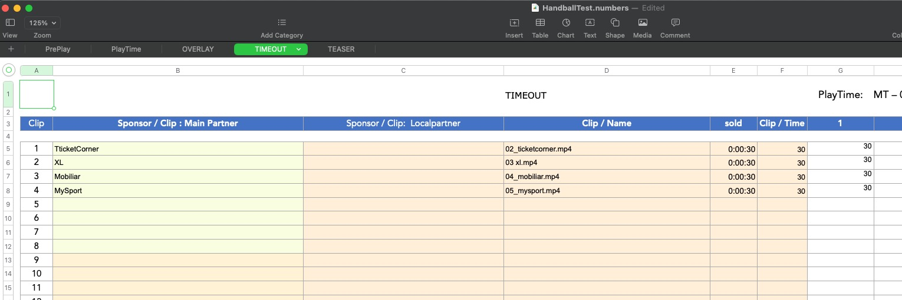
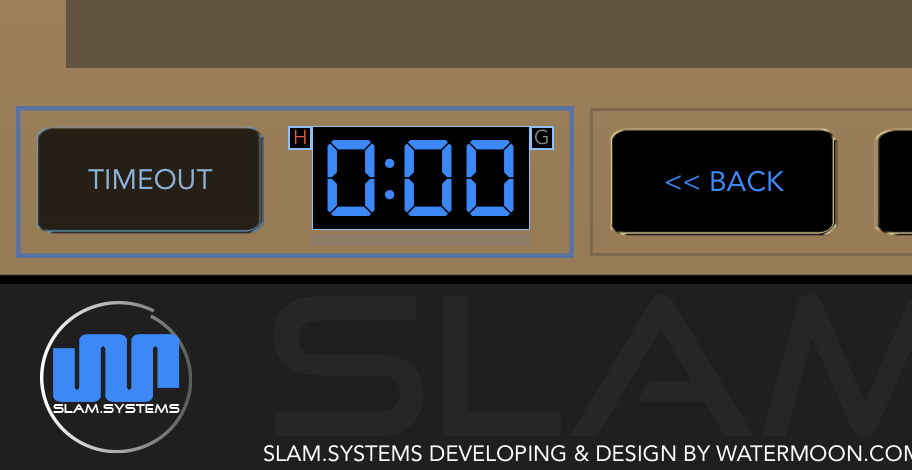

# TIMEOUT

## Noticement

1. Playlist **MUST** contain teaser list and it's content, otherwise,  teaser function can not works properly.
1. The codec of teaser clip  **MUST** using `Apple ProRes 4444` and contain alpha channel, otherwise teaser function can not be apply or unpredictable result.

   
   
 `TEASER` list must contain 2 clips, the player use the first clip as home team teaser and the second clip is guest team teaser content.
   
   
   
   
   
   
   
   

1. Playlist **MUST** contain timeout list and it's content, 
   otherwise only teaser content overlay in normal playlist content.
   
   

   **Sample of timeout list** 

## Preview

## Demostration

**Home team request timeout**
press home team button. 

home team teaser content is overlay in clip until countdown run to zero.

**Guest team request timeout**

Guest Home team button 

Guest teaser content is overlay on normal clip until countdown run to zero.

**Switch timeout clip**

Simply tap other thumbnail, when countdown run to zero, timeout will stop, you can not change it anymore.

**Cancel timeout by manually**

Just long press `TIMEOUT` button until blinking stop then teaser content and timeout content will disappear.

