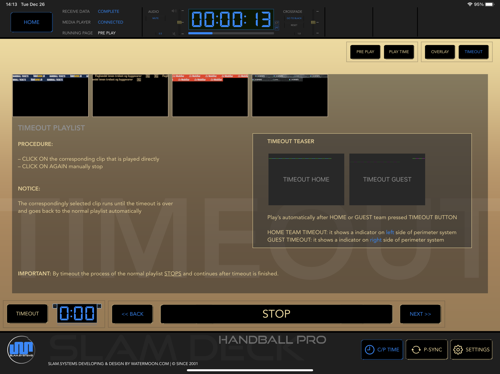
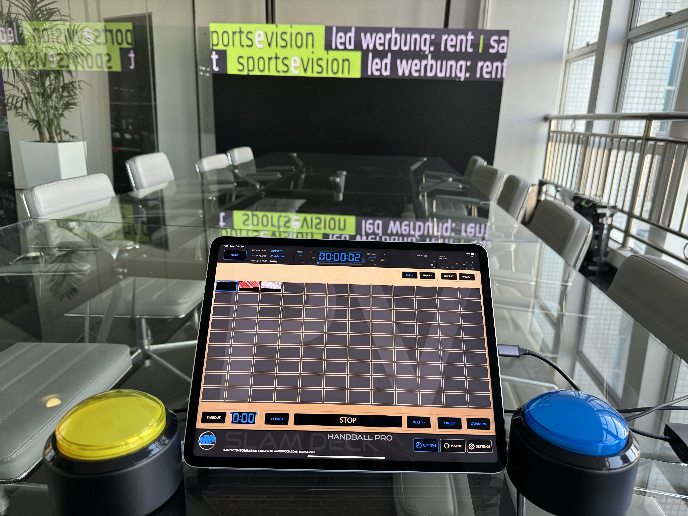
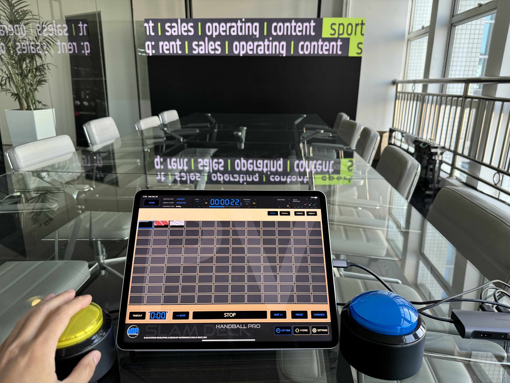
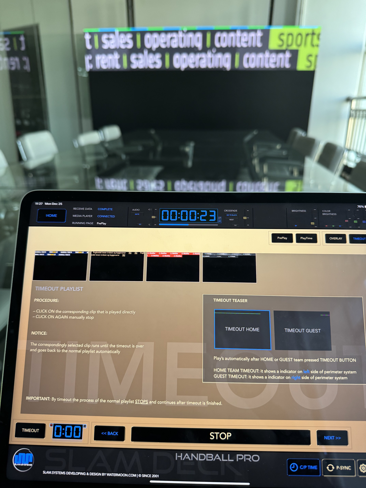
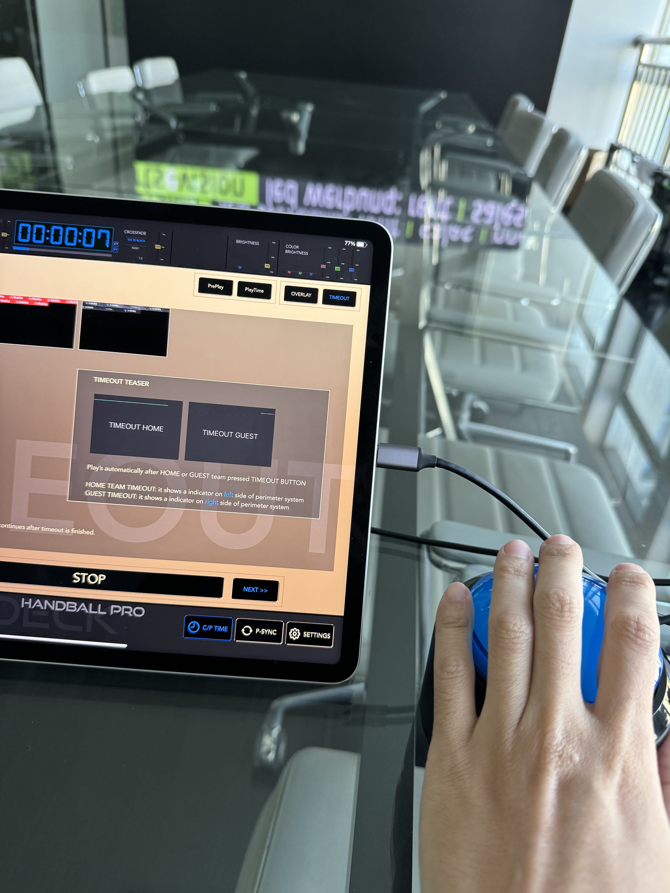
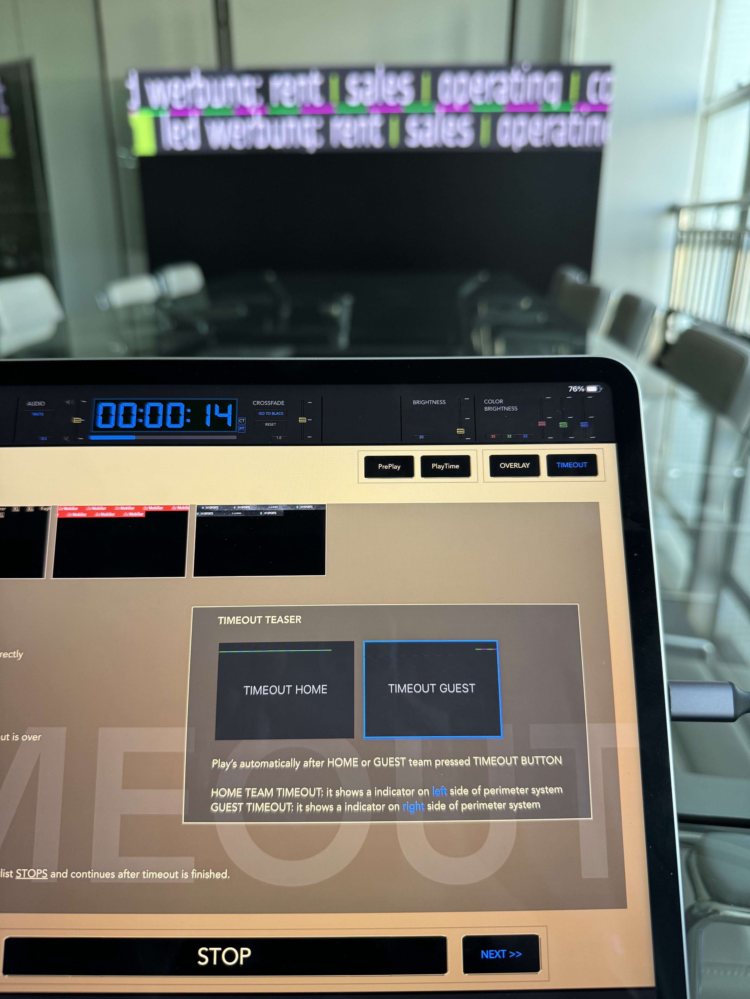

# TIMEOUT

## Noticement

1. Playlist MUST contain teaser list and it's content, otherwise,  teaser function can not works properly.
1. The codec of teaser clip  MUST using Apple ProRes 4444 and alpha channel, otherwise teaser function can not be apply or unpredictable result,  
   please well-communicate with the video post-producer to ensure that this function works properly . 
1. Playlist MUST contain timeout list and it's content, otherwise only teaser content overlay in normal playlist content.

## Preview

## Demostration

**Press Home**

Press Home team button 

home team teaser content is overlay in clip

**Press Guest**

Guest Home team button 

Guest teaser content is overlay on normal clip

