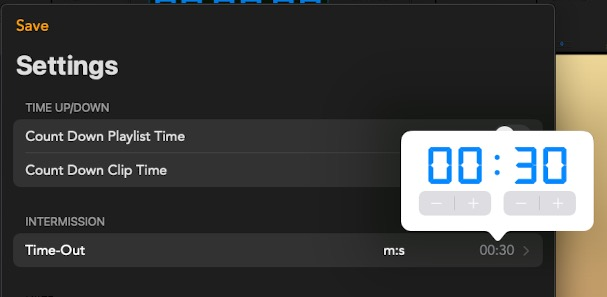

# TIMEOUT

## Noticement

1. Playlist **MUST** contain teaser list and it's content, otherwise,  teaser function can not works properly.
1. The codec of teaser clip  **MUST** using `Apple ProRes 4444` and contain alpha channel, otherwise teaser function can not be apply or unpredictable result.

   
   
 `TEASER` list must contain 2 clips, the player use the first clip as home team teaser and the second clip is guest team teaser content.
   
   
   
   
   
   
   
   

1. Playlist **MUST** contain timeout list and it's content, 
   otherwise only teaser content overlay in playing content.
   
   

   **Sample of timeout list** 

## Preview

## Demostration

**Home team ask timeout request **
press home team buzzer

home team teaser content is overlay in normal playing clip.

**Guest team request timeout**

Guest Home team buzzer 

Guest teaser content is overlay in normal playing clip.

**Play timeout clip**

Just simply tap  thumbnail and countdown start running,
once countdown running, it will stop automatically when count to ZERO.

**Switch timeout clip**

Simply tap another thumbnail, when countdown run to zero 

timeout will stop and teaser content and timeout clip will disappear.

and back to normal playing content.

**Setting countdown's seconds**

Default countdown seconds is 30 seconds,

modify countdown in below steps:

Tap the right-bottom `SETTING` --> `INTERMISSION` --> `Time-out` --> 00:30(Just for reference)

**Cancel timeout by manually**

Just long press `TIMEOUT` button until blinking stop then teaser content and timeout content will disappear.

